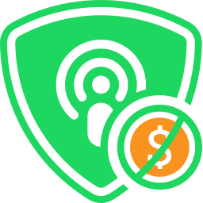

  <a href="https://spotsponsorblock.org"></img></a>

   
  Logo by <a href="https://github.com/munadikieh">@munadikieh</a>. Modified by <a href="https://github.com/jiraph">@jiraph</a>

<h1 align="center">Spot SponsorBlock</h1>

  <b>Download:</b>
  <a href="https://chromewebstore.google.com/detail/apoddhkbbnbfkhpjhpfdjachfifbedbk">Chrome/Chromium</a> |
  <a href="https://addons.mozilla.org/addon/spot-sponsorblock/?src=external-github">Firefox</a> |
  <a href="https://github.com/Spot-SponsorBlock/Spot-SponsorBlock-Extension/wiki/Android">Android</a> |
  <a href="https://microsoftedge.microsoft.com/addons/detail/sponsorblock-for-spotify-/fekacklpnbdokmiljhjbmaclgpdegpcd">Edge</a> |
  <a href="https://spotsponsorblock.org">Website</a>

    <a href="https://addons.mozilla.org/addon/spot-sponsorblock/?src=external-github"></img></a>
    <a href="https://chromewebstore.google.com/detail/apoddhkbbnbfkhpjhpfdjachfifbedbk"></img></a>

Spot SponsorBlock is an open-source crowdsourced browser extension to skip sponsor segments in Spotify podcasts. Users submit when a sponsor happens from the extension, and the extension automatically skips sponsors it knows about. It also supports skipping other categories, such as intros, outros and self promotions.

**Translate:** 

# Important Links

See the [Wiki](https://github.com/ajayyy/SponsorBlock/wiki) for important links.

# Server

The backend server is run by [Ajay](https://github.com/ajayyy) and the code is available here: https://github.com/ajayyy/SponsorBlockServer

To make sure that this project doesn't die, the database has been made publicly downloadable at https://sponsor.ajay.app/database ([License](https://github.com/ajayyy/SponsorBlock/wiki/Database-and-API-License)).

# API

You can read the API docs [here](https://wiki.sponsor.ajay.app/w/API_Docs).

# Building
See [CONTRIBUTING.md](CONTRIBUTING.md)

# Credit

Forked from the amazing [SponsorBlock](https://github.com/ajayyy/SponsorBlock). A special thanks to [Ajay](https://github.com/ajayyy) for his help throughout our development!

Icons made by:
* <a href="https://www.flaticon.com/authors/gregor-cresnar" title="Gregor Cresnar">Gregor Cresnar</a> from <a href="https://www.flaticon.com/" title="Flaticon">www.flaticon.com</a> and are licensed by <a href="https://creativecommons.org/licenses/by/3.0/" title="Creative Commons BY 3.0" target="_blank">CC 3.0 BY</a>
* <a href="https://www.flaticon.com/authors/freepik" title="Freepik">Freepik</a> from <a href="https://www.flaticon.com/" title="Flaticon">www.flaticon.com</a> and are licensed by <a href="https://creativecommons.org/licenses/by/3.0/" title="Creative Commons BY 3.0" target="_blank">CC 3.0 BY</a>
* <a href="https://iconmonstr.com/about/#creator">Alexander Kahlkopf</a> from <a href="https://iconmonstr.com/">iconmonstr.com</a> and are licensed by <a href="https://iconmonstr.com/license/">iconmonstr License</a>
* <a href="https://dazzleui.gumroad.com/l/dazzleiconsfree/" title="Dazzle Ui">Dazzle Ui</a> from <a href="https://www.svgrepo.com/" target="SVG Repo">SVG Repo</a> and are licensed by <a href="https://creativecommons.org/licenses/by/4.0/" title="Creative Commons BY 4.0" target="_blank">CC 4.0 BY</a>

### License

This project is licensed under GNU GPL v3 or any later version
